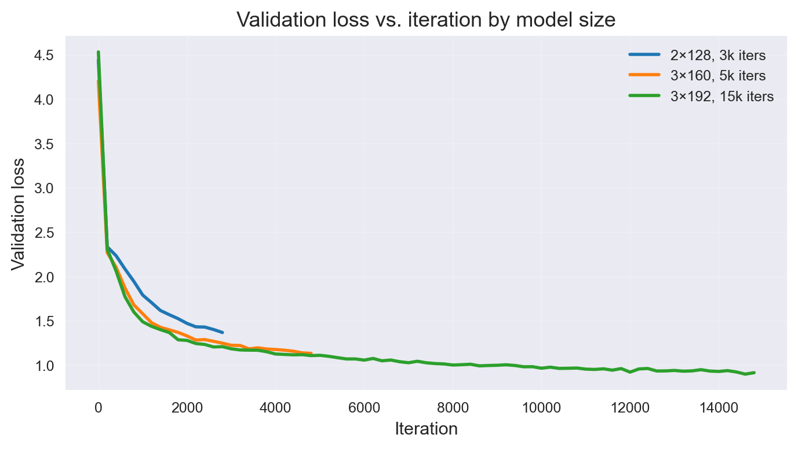

<p align="center">
  
</p>


# Aristotle‑MiniGPT


Tiny GPT‑style Transformer trained from scratch in PyTorch on a 1.5 MB corpus of public‑domain Aristotle. Character‑level next‑token prediction, multiple model sizes, full training logs, loss curves, and sample generations.


## Overview

This project implements a small GPT‑style Transformer ("Aristotle‑MiniGPT") from scratch in PyTorch and trains it on ~1.5 MB of public‑domain Aristotle text (character‑level). The goal is not to build a useful chatbot, but to see how far a tiny model can go on dense philosophical prose, and to document the learning process with clear experiments, graphs, and samples.

The repo includes:

- A scratch‑built Transformer (multi‑head self‑attention, feed‑forward blocks, residuals, layer norms).
- A minimal data pipeline (char‑level vocab, train/val split, random batches).
- Training scripts with logging, gradient clipping, LR warmup + cosine decay, and early stopping.
- Standardized qualitative probes asked to every model, plus plots comparing learning curves across model sizes.

## Architecture and data

**Data**

- ~1.5 MB of public‑domain Aristotle text (`aristotle.txt`), treated as a single character stream.
- Character‑level vocabulary (about 70 unique characters).
- 90% / 10% train/validation split.

**Model**

- GPT‑style decoder‑only Transformer:
  - Token + positional embeddings.
  - 3 Transformer blocks (multi‑head self‑attention + feed‑forward).
  - Residual connections and layer norms.
  - Linear head over the character vocabulary.

The main experiments compare three configurations:

| Name   | Layers | Emb dim | Heads | Iters | Notes           |
|--------|--------|---------|-------|-------|-----------------|
| Tiny   | 2      | 128     | 4     | 3k    | simple baseline |
| Mid    | 3      | 160     | 4     | 5k    | medium‑low      |
| Large  | 3      | 192     | 4     | 15k   | main model      |


## Training and experiments

**Objective and optimization**

- Next‑token prediction at the character level with cross‑entropy loss.
- Optimizer: AdamW (lr = 3e‑4).
- Gradient clipping: `clip_grad_norm_=1.0`.
- For the main 3×192 run:
  - 100‑step linear warmup.
  - Cosine LR decay down to 0.1× the initial learning rate.
  - Early stopping with patience on validation loss, plus best‑checkpoint saving.

**Runs**

- Tiny 2×128 @ 3k iters (no LR schedule, short baseline).
- Mid 3×160 @ 5k iters (constant learning rate).
- Large 3×192 @ 15k iters:
  - 100‑step linear warmup.
  - Cosine LR decay from 3e‑4 down to 0.1× the initial rate.
  - Early stopping on validation loss, with best checkpoint saving.

For each run, training and validation losses are logged to JSON under `logs/` and visualized with Matplotlib.

<p align="center">
  
</p>


### Learning rate schedule (3×192 run only)

For the 15k‑iteration run, the learning rate is:

- Linear warmup from 0 to 3e‑4 over the first 100 iterations.
- Cosine decay from 3e‑4 down to 3e‑5 over the remaining iterations.

This is implemented as:

```python
warmup_iters = 100
final_lr = learning_rate * 0.1

def get_lr(it):
    if it < warmup_iters:
        return learning_rate * it / warmup_iters
    progress = (it - warmup_iters) / max(1, (max_iters - warmup_iters))
    coeff = 0.5 * (1 + math.cos(math.pi * progress))
    return final_lr + (learning_rate - final_lr) * coeff
```

### Results

| Model | Layers × Emb dim | Heads | Iters (max) | Final val loss |
|-------|------------------|-------|-------------|----------------|
| Tiny  | 2 × 128          | 4     | 3k          | ~1.37          |
| Mid   | 3 × 160          | 4     | 5k          | ~1.13          |
| Large | 3 × 192          | 4     | 15k         | ~0.91          |

## Sample generations

Every trained model is asked the same three questions:

1. Hi, how are you?  
2. How would you describe the life of a happy person?  
3. Explain the concept of the golden mean.

> **Prompt:** “Explain the concept of the golden mean”

```text
Tiny  (2×128, 3k iters)
A: ... For the goodness is who he archar are man for actions of the save
particular active; and it endo a some to long is alwever, and habit,
wishes with the thill said ...

Mid   (3×160, 5k iters)
A: ... side more good to much the end and who exroy to money are of the
strong man whoo be fautness of gy happiness, and way been should love
make and activity, and are desirate the same of the seccesses of attainly ...

Large (3×192, 15k iters)
A: ... It is characteristic of such acts are intermediate between
a demand say his shares the right rule, and of honour ...
```

> Other prompts with the largest model (3×192, 15k iters)

```text
Q: Hi, how are you?
A: ... a meanness of it. A flatterer, then, is to be judged by the objects of
choice and the end of being, as a sort of acting for the sake of appearing
good to those with whom he lives ...

Q: How would you describe the life of a happy person?
A: Of the life that is called happy we say that it is in accordance with virtue,
for in such a life the acts are between excess and defect, chosen for their
own sake and in accordance with a right rule ...
```

Full, unedited generations for all models are available in `samples/`.


## Installation

Clone the repository:

```bash
git clone https://github.com/importstring/aristotle-minigpt.git
cd aristotle-minigpt
```

Create and activate the conda environment:
```bash
conda env create --file env.yml
conda activate MiniGPT
```

### Usage
Train the main (3×192) model:
```bash
python train.py
```

Chat with the trained model:
```bash
python chat.py
```
